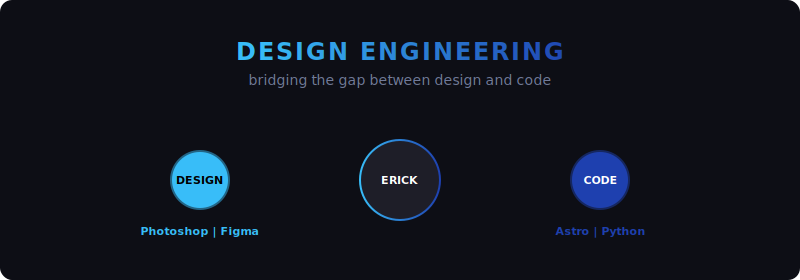

<!-- Cabeçalho Animado (Design Engineering) -->

  

 

<!-- Terminal de Digitação Interativo -->

  

<!-- Bento Grid Compatível (Tabela HTML) -->
<table width="100%">
  <!-- Linha 1: Apresentação e Status -->
  <tr>
    <td width="60%" valign="top" align="left">
      <h3>👋 Olá, sou o Erick!</h3>
      
Sou um <b>Design Engineer</b> que transita entre a arte conceitual do design e a lógica de programação. Minha missão é traduzir identidades visuais de luxo em código leve, rápido e com alta taxa de conversão.

      Foco em Vibe Coding, IA e pixel perfection.
    </td>
    <td width="40%" valign="top" align="center">
      <h4>⚡ Status Atual</h4>
      

        💻 Vibe Coding com IA 
        🌿 Desenvolvendo o Arara-Canindé 
        🔬 Projetando a marca AquaSmart
      

    </td>
  </tr>
  
  <!-- Linha 2: Ferramentas de Design e Engenharia -->
  <tr>
    <td valign="top" align="center">
      <h4>🎨 Creative Design & Branding</h4>
      
      
      
      
    </td>
    <td valign="top" align="center">
      <h4>💻 Front-End & Automation</h4>
      
      
      
    </td>
  </tr>
</table>

### 🚀 Projetos em Destaque

#### 🔬 **[AquaSmart](https://github.com/erickuidesign-dev/AQUASMART)**
*   **O que fiz:** Criação da identidade visual, posicionamento de branding e o desenvolvimento do ecossistema digital completo para a marca de aquicultura de luxo.
*   **Design & Código:** Paleta bioluminescente vibrante (Lime & Marine Blue), design system interativo completo e aplicação avançada de efeitos glassmorphism e micro-interações responsivas.

#### 🌿 **[Projeto Arara-Canindé](https://github.com/erickuidesign-dev/arara-caninde)**
*   **O que fiz:** Desenvolvimento de uma Landing Page premium e imersiva com foco em mobilização ambiental.
*   **Design & Código:** Desenvolvido com **Astro**, utilizando Island Architecture para obter **100/100 de pontuação no Google Lighthouse (SEO perfeito)**, background em vídeo otimizado e layout responsivo de altíssima qualidade.

#### 🌐 **[Website Downloader](https://github.com/erickuidesign-dev/Website-Downloader)**
*   **O que fiz:** Desenvolvimento de um crawler web robusto para clonagem e otimização offline de páginas complexas.
*   **Código:** Feito com **Python (Flask)** e **Playwright/Chromium**, capaz de baixar e otimizar assets locais, além de contornar dinâmicas de scroll de SPAs complexas.

### 🐍 Meu Histórico de Commits (Snake Game)

<picture>
  <source media="(prefers-color-scheme: dark)" srcset="https://raw.githubusercontent.com/erickuidesign-dev/erickuidesign-dev/output/github-contribution-grid-snake-dark.svg">
  <source media="(prefers-color-scheme: light)" srcset="https://raw.githubusercontent.com/erickuidesign-dev/erickuidesign-dev/output/github-contribution-grid-snake.svg">
  
</picture>

### 📊 Estatísticas do GitHub

  
  

 

  

  Construído com pixel perfection e muito código. 💻✨

